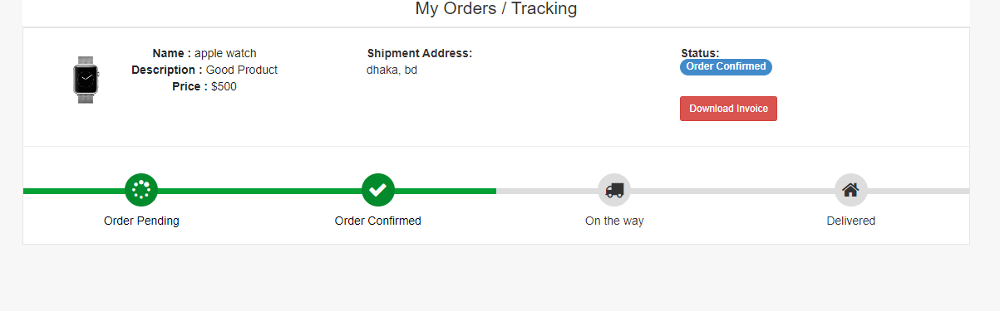
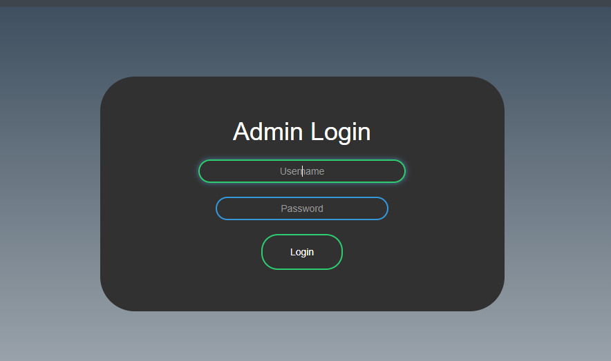
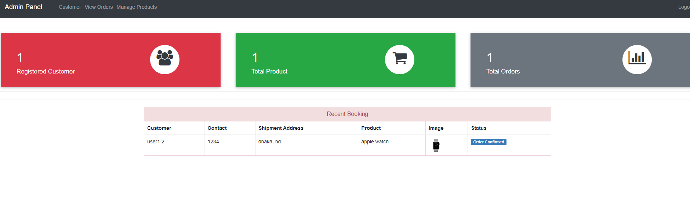

# Ecommerce WebApp Using Django Framework


A simple project based on an Online Ecommerce Site that uses Python with Django Web Framework. Following Django project contains all the important features which can be in use for the second year IT students for their college projects. It has a number of important features that will allow the users to shop online, manage orders, and more. This system as well as the website’s concept is all clear, it’s the same as real-life scenarios and well-implemented on it. 

In particular, this eCommerce site project in Python Django focuses mainly on dealing with online shopping, and order management. Also, the system displays all the available products. In addition, the system allows managing customer records. Evidently, this project is divided into two categories: Customer, and Admin Panel. In an overview of this web application, a customer can simply register from the client-side. Initially, the website displays all the available products with their respective details. Just like every other eCommerce website, this one has also got a cart system. This allows the customers to add a number of products to their cart before checking out. Speaking of check out, there’s a simple payment form that needs to be completed by the customers. In fact, the customers can view their orders list and track orders after successful payment. Besides, customers can make search queries and update their user profiles.

Improved version
Key improvements include the integration of Progressive Web App (PWA) support, enabling offline access and a mobile-first design for seamless use across devices. The system now features Role-Based Access Control (RBAC), allowing distinct user roles (Admin, Product Manager, Customer) with specific permissions to enhance security and streamline operations. A Data Analytics Dashboard has been added, providing administrators with real-time insights into sales trends and revenue, helping them make informed, data-driven decisions. Additionally, an Email Verification System has been implemented to ensure that only legitimate users can access the platform, reducing the risk of fake accounts. This project was chosen for its relevance to real-world eCommerce scenarios and its potential for practical extension. 


## Admin Panel
An administrator has full control over the system. He/she can manage customers, orders, and products. Here, each and every section has its own respective details such as name, images, and other important details. The very first step of the management of this system is to set up products. There are minor fields for each such as name, short description, price, and image. All the published products are totally visible from the client-side. By accessing the admin panel, the user can oversee the overall records such as the number of registered users, orders, and published products. Talking about the registered users, the admin can view a list of users with every possible detail. Here, the admin can take actions such as removing or updating customers’ details. 

## Order Management and Invoice
Moving towards the order management section, the system forwards each and every customer’s order details after their successful payment. By default, every order is marked under pending status which is also visible from both. An administrator can view a number of pending orders and take action accordingly. For this, an admin has to update the order status for each(codeastro.com). The user can update the status of an order from pending to order confirmed, on the way, or delivered. Which totally depends upon the status of their product and delivery stages. In fact, with each and every update, the customers can view and track each and every order. This helps to know the information about their orders and their arrivals. With it, the customers can also download an invoice from the orders section with displays every detail related to it.

Last but not least, a clean and simple dashboard is presented with various color combinations for a greater user experience while using this eCommerce Site Project in Python Django Framework. For its UI elements, a free open-source CSS framework; Bootstrap is on board with some Vanilla CSS too(codeastro.com). Presenting a new e-commerce website Project in Python Django which includes an admin panel with client-side interaction.

[Watch Full Video]()

## Available Features:

- User Registration and Login
- Product Browsing and Search
- Shopping Cart System
- Checkout and Payment Form
- Order Tracking
- Invoice Generation (PDF)
- Dashboard Overview
- Product Management
- Order Management
- ustomer Management


## File Stucrure

```shell
├── Ecommerce-WebApp (Current Directory)
    ├── ecom
    ├── ecommerce
    ├── templates
    ├── db.sqlite3
    ├── manage.py
    ├── requirements.txt
    └── static
    └── media
        
```
## Implementation Details
**1. Role-based Access Control (RBAC)**  
In enhancing the system security and organizing the responsibilities more clearly, a Role-Based Access Control (RBAC) system have been implemented. A new user role, Product Manager, have been introduced. The product manager have a restricted access related to product operations only. A dedicated views and templates have been created in order to provide the product manager with a personalized dashboard, allowing them to add, update, manage, and track products independently from Admin. 

**2. Mobile Responsiveness & PWA**  
We upgraded from Bootstrap 3 and jQuery to Bootstrap 5.3, incorporating a tag and transitioning all templates to utilize the mobile-first grid. The static .box classes have been replaced with flex-centered cards that have a maximum width. For PWA support, django-pwa was installed to generate a manifest.json, and a custom serviceworker.js was created to cache essential routes (/, /offline/) and serve an offline.html fallback.

**3. Data Analytics Dashboard**  
The implemented solution for the admin's data analytics dashboard enhances the user experience by providing key financial insights. One of the key features added is the Total Revenue display. This allows the admin to have an immediate overview of the business’s overall earnings. This gives a quick snapshot of the business's financial performance, helping the admin to always stay informed. Additionally, the Sales Trend graph was integrated, which displays the sales data for the past seven days. This dynamic line chart plots daily sales against time, giving the admin a clear visual representation of sales fluctuations. It is particularly useful for identifying trends, peak sales periods, or areas of underperformance, empowering the admin to make data-driven decisions about marketing, inventory, and customer engagement. Furthermore, a Print PDF button was added beneath the sales trend graph, enabling the admin to download a PDF report of the sales data. This feature simplifies reporting and sharing of performance data with other team members or stakeholders. Overall, this enhancement significantly improves the dashboard’s functionality, providing real-time, actionable insights that help in making informed decisions for business growth and efficiency.

**4. Email Verification System**  
To improve security during user registration, we’ve implemented an email verification system. This ensures that only valid email addresses can be used to access the platform. Upon successful registration, a verification email with a secure activation link is sent to the user. The account remains inactive until the user clicks the link, which then activates the account. This not only reduces the number of fake and spam accounts but also enhances communication reliability, especially for features that rely on email notifications. The solution integrates with Django’s built-in authentication and utilizes Django’s token-based system for secure account activation. It follows a modular approach that can be reused or extended.


## How to Install and Run this project?

### Installation
**1. Create a Folder where you want to save the project**

**2. Create a Virtual Environment and Activate**

Install Virtual Environment First
```
$  pip install virtualenv
```

Create Virtual Environment

For Windows
```
 python -m venv venv
```
For Mac
```
python3 -m venv venv
```

Activate Virtual Environment

For Windows
```
source venv/scripts/activate
```

For Mac
```
source venv/bin/activate
```

**3. Install Requirements from 'requirements.txt'**
```
pip install -r requirements.txt
```

**4. make database migrations**
```python
python manage.py migrate
```

**5. Login Credentials**

Create Super User (HOD)
```
$  python manage.py createsuperuser
```
Then Add Email, Username and Password

**6. Now Run Server**

Command for Windows:
```python
$ python manage.py runserver
```

Command for Mac:
```python
$ python3 manage.py runserver
```

## Screenshots






## Contributing

Contributions are always welcome!

See `contributing.md` for ways to get started.

Please adhere to this project's `code of conduct`.


## Authors
- [@naemazam](https://github.com/naemazam?tab=repositories)

## Contributors 
- NURUL NATASHA ADILYN BINTI FADZIL
- ANIS NUR HANANI
- KOH SHENG EE
- ADIL AZRAIE


## License

[MIT](https://choosealicense.com/licenses/mit/)


